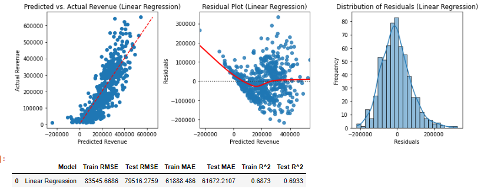
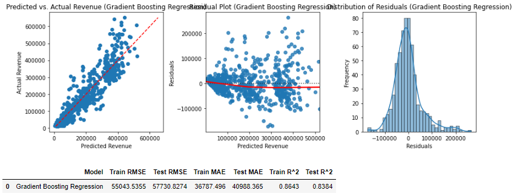
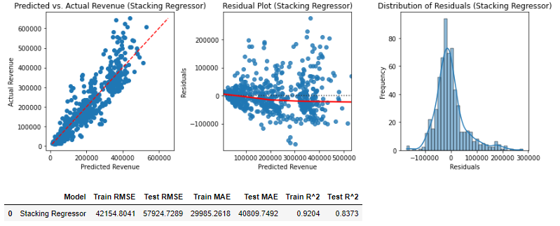
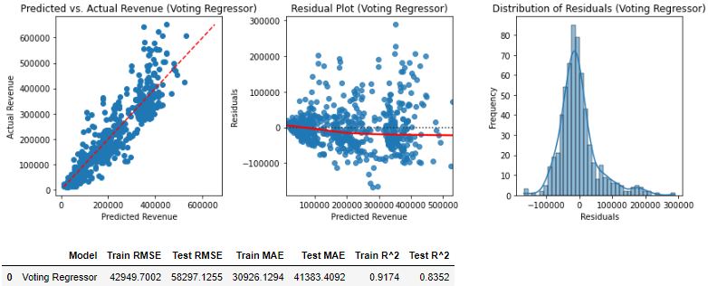
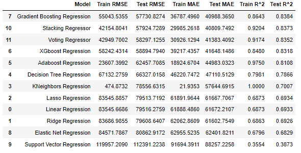

# Peak Performance: Predictive Modeling for Vacation Rental Revenue

**Authors**: David Johnson

## Overview

In the realm of short-term vacation rental businesses, the ability to predict revenue accurately plays a pivotal role in decision-making processes. As the market for short-term rentals continues to expand rapidly, property owners and managers face the challenge of maximizing profitability while meeting the diverse needs of guests.

This capstone project endeavors to address this challenge by developing a predictive model that can forecast revenue based on a variety of factors including the number of bedrooms, accommodation capacity, location, and available amenities. The significance of such a model lies in its potential to provide valuable insights into the profitability of potential rental properties, enabling stakeholders to make informed decisions about property investments and management strategies.

## Business Problem


[Cloud 9 Cabins](https://www.cloud9cabins.com/), a prominent player in the vacation rental industry, is poised for expansion and seeks to diversify its property portfolio. However, the company faces a critical challenge: determining the profitability of potential new properties before committing significant resources to their development. This challenge underscores the importance of accurately predicting revenue for each property based on its unique characteristics. By doing so, Cloud 9 Cabins can make informed decisions about which properties to invest in, mitigating the risk of investing in unprofitable ventures and maximizing returns on investment.

The real-world problem at hand is twofold: first, the uncertainty surrounding the revenue potential of new vacation rental properties; and second, the need for Cloud 9 Cabins to optimize its investment strategy to ensure sustainable growth and profitability. The stakeholders directly impacted by this problem include not only Cloud 9 Cabins itself, but also property owners, investors, and local communities seeking economic opportunities. For Cloud 9 Cabins, the ability to accurately predict revenue serves as a cornerstone for strategic decision-making, enabling them to allocate resources efficiently and pursue growth opportunities with confidence.

## Data


The dataset used in this project was sourced from [AirDNA](https://www.airdna.co/?utm_term=airdna&utm_campaign=brand&utm_source=google&utm_medium=cpc&hsa_acc=6167315757&hsa_cam=17800124565&hsa_grp=142138831187&hsa_ad=611451046477&hsa_src=g&hsa_tgt=kwd-316106200999&hsa_kw=airdna&hsa_mt=e&hsa_net=adwords&hsa_ver=3&gad_source=1&gclid=CjwKCAjw_e2wBhAEEiwAyFFFo69feFRzrMUqCeCQucViuSTUbInd0CrYUD8ZJitUSwl5vGJBddEbCBoCWjkQAvD_BwE). AirDNA is a data analytics company specializing in short-term vacation rental market intelligence. They offer a range of services and products designed to provide valuable insights into the vacation rental industry, helping property owners, managers, investors, and other stakeholders make informed decisions. Here are some key aspects of what AirDNA offers:

1. **Market Data and Analytics:** AirDNA collects and analyzes data from various sources, including vacation rental platforms like Airbnb and Vrbo, to provide comprehensive market insights. This data includes information on rental rates, occupancy rates, demand trends, and other key metrics at both the macro and micro levels.

2. **Competitive Analysis:** AirDNA's platform allows users to conduct competitive analysis by comparing their properties to similar listings in their market. This helps users understand their position relative to competitors and identify opportunities for optimization.

3. **Revenue Management Tools:** AirDNA offers tools and features to help property owners and managers optimize their revenue generation strategies. This may include pricing recommendations based on market demand and competitor analysis, as well as insights into seasonal trends and events impacting rental demand.

4. **Investment Analysis:** AirDNA's data can be valuable for investors looking to assess the potential profitability of vacation rental properties. By providing insights into market dynamics and revenue potential, AirDNA helps investors make data-driven decisions about property acquisitions and portfolio management.

5. **Market Reports and Insights:** AirDNA publishes regular reports and insights on trends and developments in the vacation rental industry. These reports cover topics such as market growth, regulatory changes, and emerging trends, providing valuable information for industry professionals.

For this project, we leveraged AirDNA's comprehensive comp data, sourced from platforms such as Airbnb, Vrbo, third-party data providers, and existing users of AirDNA. This dataset includes information on existing vacation rental properties, encompassing details such as revenue, amenities, occupancy rates, and more. 

Due to the proprietary status of data, the full dataset can not be shared through this analysis. We can only share insights and results of our work. Interested parties can gain access to this wealth of data by reaching out to AirDNA and engaging with one of their sales representatives.

## Data Preprocessing

Here's a summary of the data preprocessing steps:

1. Removed non-comparable properties based on criteria such as available nights, minimum stay duration, property reviews, revenue, and occupancy to focus on relevant short-term rental properties.
2. Encoded boolean features and amenity values to numeric labels for modeling purposes.
3. Eliminated unnecessary columns such as URLs and unique identifiers, as well as highly correlated predictors like 'ADR'.
4. Implemented manual mapping for price tiers to categorize properties into distinct price segments.
5. Developed a data preprocessing pipeline to efficiently handle numeric and categorical variables, prevent data leakage, and facilitate model testing.

This comprehensive preprocessing approach ensures that the dataset is optimized for analysis and modeling, leading to more accurate predictions and insights.

## Results

Many models were tested in this analysis, but below we will only highlight the top performing models, along with the baseline model. Please refer to my notebook for all models tested.

### Baseline Models (Linear Regression)

The baseline Linear Regression model demonstrates relatively high RMSE (Root Mean Squared Error) and MAE (Mean Absolute Error) values, indicating notable discrepancies between predicted and actual revenue figures. Although the model exhibits moderate overfitting, with slightly lower error metrics on the test dataset compared to the training set, both RMSE and MAE values remain elevated. Additionally, the R^2 (coefficient of determination) values, reflecting the model's explanatory power, are moderate, suggesting that while the model captures a portion of the revenue variance, there is ample room for improvement. Despite serving as a starting point, the baseline model underscores the need for refinement to enhance predictive accuracy and better understand revenue dynamics.

Moving forward we will use Test $R^2$ as a comparison metric.



### Gradient Boosting Regressor 

The Gradient Boosting Regression model, after hyperparameter tuning, achieved impressive performance. It obtained a test RMSE of 57730.83, this suggests that, on average, the model's revenue predictions deviate from the actual revenue by approximately 57,730.83. The model's test MAE was 40988.37, this metric is similar to RMSE but it gives equal weight to all errors and does not penalize large errors more heavily than small ones, whereas RMSE does. Additionally, the R-squared values for the train and test sets were 0.8643 and 0.8384, respectively.

Comparing these results to the baseline model, we observe a significant improvement in both train and test R-squared values, indicating better explanatory power and generalization capability of the Gradient Boosting Regression model. Therefore, it can be concluded that the Gradient Boosting Regression model is the best-performing model so far for this dataset.



### Ensemble Modeling

#### Stacking Regressor

A stacking regressor is an ensemble learning technique that combines the predictions of multiple base regression models to make a final prediction. In this case, I used the best three regression models that were previously tested (AdaBoost, XGBoost, and Gradient Boosting) as the base estimators for the stacking regressor. These models were chosen because they demonstrated the highest performance during testing. Additionally, I selected Linear Regression as the final estimator because it is a simple yet effective model that is suitable for combining the predictions of the base models.

The stacking regressor achieved a high $R^2$ score of 0.8373 on the test data, but did not outperform the Gradient Boosting Regressor. This indicates that the model performs well in capturing the variance in the target variable for both the training and test datasets. The stacking approach, which combines predictions from multiple base models (AdaBoost, XGBoost, and Gradient Boosting), followed by a linear regression final estimator, appears to have effectively leveraged the strengths of these individual models to improve overall performance.



#### Voting Regressor

The Voting Regressor is an ensemble learning technique that combines the predictions from multiple individual regression models to produce a single aggregated prediction. It operates by averaging the predictions of its constituent models or by considering the majority vote, depending on whether it's a regression or classification problem.

In this case, I set up the Voting Regressor using the following three base estimators:

1. AdaBoost Regressor (best_ab_model)
2. XGBoost Regressor (best_xg_model)
3. Gradient Boosting Regressor (best_gbr_model)

The Voting Regressor achieved a relatively low RMSE and MAE on both the training and test sets, indicating good predictive performance. The $R^2$ scores are also high, suggesting that the model explains a significant portion of the variance in the target variable. However, the performance is slightly lower compared to the Stacking Regressor, indicating that the ensemble of models might not be capturing the underlying patterns as effectively.



## Conclusions



Based on the evaluation of various regression models, the Gradient Boosting Regression stands out as the top performer with the highest test R^2 value (0.8384) and the lowest test RMSE and MAE values among all models. This indicates that the Gradient Boosting Regression model explains a significant portion of the variance in the target variable and makes more accurate predictions compared to other models.

For Cloud 9 Cabins, this model would be incredibly valuable for making decisions regarding which properties to build next. By using the Gradient Boosting Regression model, they can predict with reasonable accuracy how much revenue they can expect from each potential property. This information can inform their investment decisions, allowing them to prioritize properties that are likely to generate higher returns.

In essence, the Gradient Boosting Regression model provides Cloud 9 Cabins with a powerful tool for optimizing their business strategy, enabling them to allocate resources more effectively and maximize profitability.

### Next Steps

Further analyses could yield additional insights to how we can further improve our revenue prediction model:

Customer Segmentation: Explore customer segmentation techniques to identify distinct groups of customers based on their booking behavior, demographics, or preferences. By understanding different customer segments, Cloud 9 Cabins can tailor their marketing strategies, pricing models, and property offerings to better meet the needs and preferences of each segment, ultimately driving revenue growth.

- **Feature Engineering:** Explore additional features or engineer new ones that could better capture the underlying patterns in the data. This might involve incorporating external datasets, creating interaction terms, or transforming existing features to better align with the target variable.

- **Time-Series Analysis:** Since the dataset likely contains temporal information about property rentals (e.g., dates of bookings, seasonal trends), consider incorporating time-series analysis techniques. This could involve modeling temporal patterns, detecting seasonality, and incorporating lag features to capture historical trends, which may further improve revenue predictions.

- **Customer Segmentation:** Explore customer segmentation techniques to identify distinct groups of customers based on their booking behavior, demographics, or preferences. By understanding different customer segments, Cloud 9 Cabins can tailor their marketing strategies, pricing models, and property offerings to better meet the needs and preferences of each segment, ultimately driving revenue growth.

By implementing these next steps, we can further enhance the performance and robustness of our model.


## For More Information

See the full analysis in the [Jupyter Notebook](./Final_notebook.ipynb) or review this [presentation](./final_presentation.pdf).

## Repository Structure

```
├── data
├── images
├── README.md
├── final_presentation.pdf
└── Final_notebook.ipynb
```